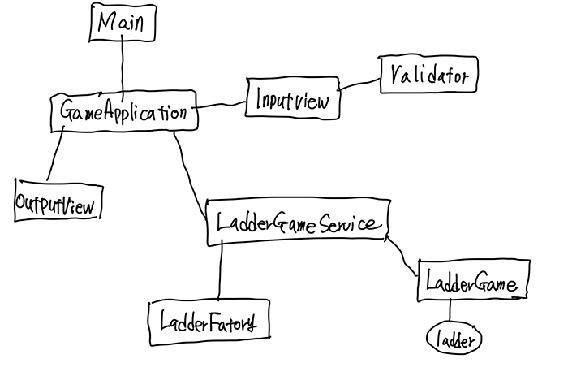

# java-ladder

2022 마스터즈 백엔드 사다리 게임 프로젝트

---

## 개발 환경
- jdk : jdk11
- IDE : IntelliJ Ultimate(2021.3.2)

---

## 빌드 환경

- Project : Gradle Project
- Dependencies(의존 라이브러리)
  - 테스트 편의를 위해 gradle을 통해 테스트 라이브러리를 추가했다.
      - JUnit Jupiter API : JUnit5의 "junit-jupiter-api" 모듈
      - AssertJ : JUnit 기반 테스트의 표현력 부족을 보완한 테스트 라이브러리

  - **그 외에는 추가한 라이브러리는 없다.**

---

## 의존 관계도

- Main의 메인메서드에서 GameApplication을 생성, 호출
- GameApplication은 AppConfig을 통해 의존관계를 주입받은채 초기화된다.
- 사용자로부터 InputView를 통해 필요 인자를 입력받음
  - InputView는 Validator을 의존하며, 이것이 유효성 검사를 해줌
- 게임 초기화 : 필요 인자를 LadderGameService를 통해 전달함.
  - 인자를 입력받으면 LadderFactory 에게 전달하여 Ladder을 생성
  - 이를 기반으로 LadderGame 초기화
- 결과 얻어오기 : LadderService에게 특정 결과를 요청하여 얻어옴
- 결과 출력 : OutputView에서 결과값을 전달받아 적절히 출력

---

## Main 클래스

```java

public class Main {

    public static void main(String[] args) {
        GameApplication gameApplication = new GameApplication();
        gameApplication.run();
    }
}
```
- main 메서드가 정의된 클래스
- GameApplication 인스턴스 생성
- run 메서드 호출

---

## GameApplication
```java
public class GameApplication {

  private AppConfig ac;
  private InputView inputView;
  private OutputView outputView;
  private LadderGameService ladderGameService;

  public GameApplication() {
    init();
  }

  private void init() {
    ac = AppConfig.getInstance();
    inputView = ac.inputView();
    outputView = ac.outputView();
    ladderGameService = ac.ladderGameService();
  }

  public void run() {
    initLadderGame();
    String resultMap = ladderGameService.getResultMap();
    outputView.printResultMap(resultMap);
    ac.close();
  }

  private void initLadderGame() {
    List<User> users = inputView.inputUsers();
    int height = inputView.inputHeight();
    ladderGameService.initLadderGame(users, height);
  }
}
```
- 실제 실행 역할을 담당함.
- 생성자 호출 시, init 메서드를 호출하여 초기화
- AppConfig 인스턴스를 기반으로, 의존 인스턴스들을 초기화한다.
- run 메서드를 호출하면 실행됨

---

## AppConfig 클래스
```java
public class AppConfig {

  private static AppConfig instance = new AppConfig();

  private AppConfig() {}

  public static AppConfig getInstance() {
    return instance;
  }

  public LadderGameService ladderGameService() {
    return LadderGameServiceImpl.getInstance(ladderFactory(), ladderGameMapDecorator());
  }

  public LadderFactory ladderFactory() {
    return LadderFactoryImpl.getInstance();
  }

  public LadderGameMapDecorator ladderGameMapDecorator() {
    return LadderGameMapDecoratorImpl.getInstance();
  }

  public Validator validator() {
    return ValidatorImpl.getInstance();
  }

  public InputView inputView() {
    return InputViewImpl.getInstance(validator());
  }

  public OutputView outputView() {
    return OutputViewImpl.getInstance();
  }

  public void close() {
    try {
      inputView().close();
    } catch (Exception e) {
      System.out.println("자원 반환 실패");
    }
  }
}
```
- 주요 싱글톤 인스턴스들의 의존성을 관리해주는 설정 클래스 (싱글톤)
- 자원을 반환하려면, 수동으로 close 메서드를 호출하여 자원을 반환해야함.

---
## LadderGame

```java
public class LadderGame {

  private final List<User> users;
  private final Ladder ladder;

  LadderGame(List<User> users, Ladder ladder) {
    this.users = users;
    this.ladder = ladder;
  }

  Ladder getLadder() {
    return this.ladder;
  }

  List<String> getUserNames() {
    return users.stream()
            .map(User::getName)
            .collect(Collectors.toList());
  }
}
```
- 사다리 게임을 정의한 LadderGame 클래스를 정의
- 같은 패키지 안에서만 생성 가능
- `getLadder` : ladder를 반환함. (같은 패키지 안에서만 호출 가능)
- `getUserNames` : 사용자의 이름들을 List로 반환 (같은 패키지 안에서만 호출 가능)

---
## User
```java
public class User {

  private final String name;

  public User(String name) {
    this.name = name;
  }

  public String getName() {
    return name;
  }

  @Override
  public boolean equals(Object o) {
    if (this == o) return true;
    if (o == null || getClass() != o.getClass()) return false;
    User user = (User) o;
    return name.equals(user.name);
  }

  @Override
  public int hashCode() {
    return Objects.hash(name);
  }
}
```
- 사용자를 정의한 클래스
- name : 사용자명
- 동등성 : name이 같으면 동등한 객체로 간주(equals, hashCode)
---
## Ladder
```java
public class Ladder {

  private final List<List<LadderElement>> ladderElements;

  Ladder(List<List<LadderElement>> ladderFrame) {
    this.ladderElements = ladderFrame;
  }

  public LadderElement getLadderElement(int column, int row) {
    return ladderElements.get(row).get(column);
  }

  void setLadderElement(int column, int row, LadderElement ladderElement) {
    ladderElements.get(row).set(column, ladderElement);
    return;
  }

  public int width() {
    return ladderElements.get(0).size();
  }

  public int height() {
    return ladderElements.size();
  }

}
```
- 사다리를 정의한 클래스
- 내부적으로 `List<List<LadderElement>>`를 가짐. 내부 이차원List는 `LadderElement`를 가지고 있다.
- getLadderElement : 지정 행, 열의 LadderElement 반환
- setLadderElement : 지정 행, 열의 LadderElement을 변경. 접근제어자가 default라서, 외부 패키지에서 변경할 수 없다.
  - 변경 가능성 : LadderFactory에서만.

---

## LadderElement (enum)
```java
public enum LadderElement {

  VERTICAL_LINE("|"),
  HORIZONTAL_LINE("-----"),
  EMPTY_LINE("     ");

  private String symbol;

  LadderElement(String symbol) {
    this.symbol = symbol;
  }

  public String getSymbol() {
    return this.symbol;
  }
}
```
- 사다리의 구성 요소들을 enum으로 정의
- 요소
  - 세로라인은 VERTICAL_LINE
  - 가로라인은 HORIZONTAL_LINE
  - 빈 가로라인(사다리 가로라인이 없는 경우)은 EMPTY_LINE

---

## LadderFactory (interface)
```java
public interface LadderFactory {

  Ladder create(int numberOfUsers, int height);
}
```
- `Ladder`을 생성하는 역할
- 구현체 : LadderFactoryImpl

---

## LadderGameService (interface)
```java
public interface LadderGameService {

  void initLadderGame(List<User> users, int height);
  String getResultMap();
}
```
- LadderGame에 관한 핵심적인 비즈니스 로직을 담당함
- initLadderGame : 사다리 게임 초기화
- getResultMap : 사다리 게임맵을 문자열로 반환
- 구현체 : LadderGameServiceImpl

---

## LadderGameMapDecorator (interface)
```java
public interface LadderGameMapDecorator {

    String drawLadderGameMap(List<String> userNames, Ladder ladder);

}
```
- 사다리를 그려서 문자열로 반환하는 역할
---

## Validator (interface)
```java
public interface Validator {

  void validateUserName(User user);
  void validateNumberOfUsers(List<User> users);
  void validateDuplicateUsers(List<User> users);
  void heightValidate(int height);

}
```
- 입력값에 대한 유효성 검사, 유효하지 않으면 예외를 throw
  - validateUserName : 이름의 유효성
  - validateNumberOfUser : 참가자 수의 유효성
  - validateDuplicateUsers : 참가자의 중복여부 검증
  - heightValidate : 높이의 유효성 검증
- 구현체 : ValidatorImpl

---

## InputView (interface)
```java
public interface InputView {

  List<User> inputUsers();
  int inputHeight();
  void close();
}
```
- InputView : 사용자로부터 입력을 받는 역할을 정의한 인터페이스
  - inputUsers : 참가자 명단을 입력받음.
  - inputHeight : 사다리 높이
  - close : 입력에 사용했던 자원 반환
- InputViewImpl : 구현체

---

## OutputView (interface)
```java
public interface OutputView {

  void printResultMap(String resultMap);

}
```
- OutputView : 결과 출력 역할을 담당하는 인터페이스
- OutputViewImpl : 구현체

---
