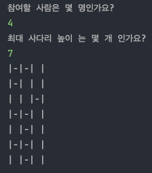
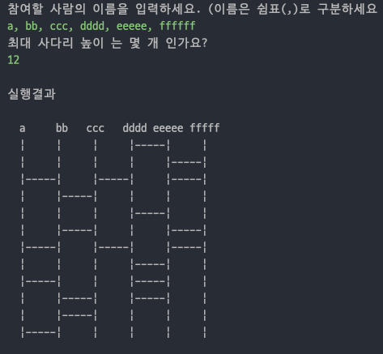

# 2022 마스터즈 백엔드 사다리 게임 프로젝트

## 사다리 게임 1단계 - 기본 기능 구현

### 기능요구사항

* [x] 간단한 사다리 게임을 구현한다.
* [x] n명의 사람과 m개의 사다리 개수를 입력할 수 있어야 한다.
* [x] 사다리의 라인은 랜덤 값에 따라 있거나 없을 수도 있다.
* [x] 사다리가 있으면 -를 표시하고 없으면 " " (공백문자)를 표시한다. 양옆에는 |로 세로를 표시한다.
* [x] 사다리 상태를 화면에 출력한다. 어느 시점에 출력할 것인지에 대한 제약은 없다.

### 프로그래밍 요구사항

* [x] 메서드의 크기가 최대 10라인을 넘지 않도록 구현한다.
* [x] 메서드가 한 가지 일만 하도록 최대한 작게 만들자.
* [x] 2차원 배열을 학습하고 이를 이용해서 문제를 해결한다.

### 프로젝트 구조

```shell
.
├── README.md
└── src
    └── dukcode
        ├── Main.java
        ├── controller
        │   └── LadderController.java
        ├── model
        │   └── Ladder.java
        └── view
            ├── PrintView.java
            └── ScanView.java
```

### 구현

#### 1. 전체적인 프로세스

* `ScanView`에 `Scanner`를 주입해 생성하고 입력을 처리해 결과를 `LadderController`에 넘겨준다.
* `LadderController`에서 `Ladder`를 초기화 하고 결과를 `PrintView`에 넘겨 결과를 출력하도록 한다.

```java
public class Main {

    public static void main(String[] args) {
        Scanner sc = new Scanner(System.in);
        ScanView scanView = new ScanView(sc);
        Ladder ladder = new Ladder();
        PrintView printView = new PrintView(ladder);
        LadderController ladderController = new LadderController(printView, ladder);

        ladderController.initLadder(scanView.getNumPlayer(), scanView.getHeight());
        ladderController.updatePrintView();
        sc.close();
    }
}
```

#### 2. `Ladder.init()` 구현

* 클린한 코드를 위해 2중 `for`문을 피하는 코드를 작성했다. 따로 `line`을 초기화 하는 함수를 구현했다.
* `Ladder`의 2차원 배열은 steps(발판)만 있어도 되기 때문에 가로 축이 player의 수 보다 1 작게 만들었다.

```java
    public void init(int numPlayer, int height) {
        this.numPlayer = numPlayer;
        this.height = height;

        ladder = new boolean[height][numPlayer - 1];
        for (int line = 0; line < height; ++line) {
        initLine(line);
        }
    }

    private void initLine(int line) {
        Random rd = new Random();
        for (int step = 0; step < numPlayer - 1; ++step) {
        ladder[line][step] = rd.nextBoolean();
        }
    }
```

### 3. `Ladder.toString()` 구현

* `StringBuilder`를 사용해 `append()`하기 수월하게 구현하였다.
* 2중 `for`문을 피하기 위해 `line`에 대한 `String`을 받아오는 함수를 따로 구현하였다.
* 이 `String`정보를 `PrintView`에 넘겨 결과를 출력한다.

```java
    public String toString() {
        StringBuilder sb = new StringBuilder();
        for (int line = 0; line < height; ++line) {
        sb.append(getStringLine(line));
        sb.append("\n");
        }

        return new String(sb);
    }

    public String getStringLine(int line) {
        StringBuilder strLine = new StringBuilder("|");
        for (int step = 0; step < numPlayer -1; ++step) {
        strLine.append(ladder[line][step] ? "-" : " ");
        strLine.append("|");
        }

        return new String(strLine);
    }
```

### 실행 결과



## 사다리 게임 2단계 - 리팩토링 맛보기

### 기능요구사항

* [x] 1단계 요구사항과 동일함

### 프로그래밍 요구사항

* [x] 메서드의 크기가 최대 10라인을 넘지 않도록 구현한다.
* [x] 메서드가 한 가지 일만 하도록 최대한 작게 만들어라.
* [x] 들여쓰기(indent) depth를 2단계에서 1단계로 줄여라.
* [x] depth의 경우 if 문을 사용하는 경우 1단계의 depth가 증가한다. if 문 안에 while 문을 사용한다면 depth가 2단계가 된다.
* [x] else를 사용하지 마라.
* [x] 구현 순서를 고려하면서 프로그래밍한다.
* [x] naming convention을 지키면서 프로그래밍한다.

### 리팩토링 과정

#### 1. 변수 인라인화

* `ScanView`의 `getNumPlayer()`메서드와 `getHeight()`메서드의 필요 없는 변수를 인라인화 시켰다.

```java
    public int getnumplayer() {
        system.out.println("참여할 사람은 몇 명인가요?");
        int numplayer = sc.nextint();

        return numplayer;
        }
        
// -->        

    public int getnumplayer() {
        system.out.println("참여할 사람은 몇 명인가요?");
        return sc.nextInt();
        }
```

#### 2. 어노테이션 추가

* 'Ladder'클래스의 `toString()`메서드에 어노테이션을 추가했다.

```java
    @Override
    public String toString() {
        StringBuilder sb = new StringBuilder();
        for (int line = 0; line < height; ++line) {
            sb.append(getStringLine(line));
            sb.append("\n");
        }

        return new String(sb);
        }
```

#### 3. 접근 제한자 변경

* `private`, `public` 구분하여 변경

```java

public String getStringLine(int line);

// -->

private String getStringLine(int line);
```

#### 4. `PrintView`에서 `Ladder 정보`를 받아 처리하도록 변경

* 기존 `Ladder`클래스에서 `toString()`메서드로 출력 결과를 `PrintView`로 넘겨주던 것을 **정보**만 넘겨주고 출력 처리는 `PrintView`에서 하도록 변경
* `Ladder`클래스에서 `ladder` 배열을 그냥 넘겨주지 않고 복사해서 넘겨주도록 함

```java
// Ladder class
public boolean[][] getLadder() {
    boolean[][] copyLadder = new boolean[height][numPlayer - 1];
    for (int line = 0; line < height; ++line) {
        System.arraycopy(ladder[line], 0, copyLadder[line], 0, ladder[line].length);
        }

    return copyLadder;
}

// PrintView class
public void printLadder() {
    final boolean[][] ladder = this.ladder.getLadder();
    final int height = this.ladder.getHeight();
    final int numSteps = this.ladder.getNumSteps();

    StringBuilder sb = new StringBuilder();
    for (int line = 0; line < height; ++line) {
        sb.append(getStringLine(ladder[line], numSteps));
        sb.append("\n");
    }

    System.out.println(sb);
}

private StringBuilder getStringLine(boolean[] line, int numSteps) {
    StringBuilder strLine = new StringBuilder(SIDE_RAIL);
    for (int step = 0; step < numSteps; ++step) {
        strLine.append(line[step] ? STEP : BLANK);
        strLine.append(SIDE_RAIL);
    }

    return strLine;
}
```

## 사다리 게임 3단계 - 사다리 모양 개선

### 기능 요구 사항

* [x] 사다리 게임에 참여하는 플레이어의 이름을 최대 5글자까지 부여할 수 있다.
* [x] 사다리 출력시 이름도 같이 출력한다.
* [x] 사람 이름은 쉼표(,)를 기준으로 구분한다.
* [x] 사람 이름을 5자 기준으로 출력하기 때문에 사다리 폭도 넓어져야 한다.
* [x] 사다리 타기가 정상적으로 동작하려면 라인이 겹치지 않도록 해야 한다.
  * [x] `|-----|-----|` 모양과 같이 가로 라인이 겹치는 경우 어느 방향으로 이동할지 결정할 수 없다.

### 프로그래밍 요구사항

* [x] 메소드의 크기가 최대 10라인을 넘지 않도록 구현한다.
  * [x] method가 한 가지 일만 하도록 최대한 작게 만들어라.
* [x] indent(들여쓰기) depth를 2단계에서 1단계로 줄여라.
  * [x] depth의 경우 if문을 사용하는 경우 1단계의 depth가 증가한다. if문 안에 while문을 사용한다면 depth가 2단계가 된다.
* [x] else를 사용하지 마라.
* [x] 배열 대신 ArrayList와 Generic을 활용해 구현한다.

### 구현 과정

#### 1. 이름을 입력받도록 수정

* `PrintView`에서 이름을 입력받고 길이가 5자가 넘으면 5자로 수정해서 넘기도록 변경함

   ```java
    public String[] getPlayerName() {
        System.out.println("참여할 사람의 이름을 입력하세요. (이름은 쉼표(,)로 구분하세요");
        String[] namePlayers = sc.nextLine().split(",");
        for (int i = 0; i < namePlayers.length; ++i) {
            namePlayers[i] = getNameLengthBelow5(namePlayers[i].trim());
        }
        return namePlayers;
        }

    private String getNameLengthBelow5(String name) {
        if (name.length() <= 5) {
            return name;
        }

        return name.substring(0, 5);
        }
   ```

* `Ladder` 클래스에 이름에 관한 멤버변수를 추가하고 `init()`시 이름도 초기화하도록 함.

   ```java
    public void init(String[] namePlayers, int height) {
        this.namePlayers = namePlayers;
        this.numPlayer = namePlayers.length;
        this.numSteps = namePlayers.length - 1;
        this.height = height;

        ladder = new ArrayList<>();
        for (int lineNum = 0; lineNum < height; ++lineNum) {
            initLine(lineNum);
        }
    }
   ```

#### 2. 이름을 출력하도록 구현

* `PrintView` 클래스에서 이름 앞 뒤로 패딩을 붙여 출력하도록 구현

   ```java
    private String getNameWithPadding(String name) {
        int count = 0;
        while (name.length() < 5) {
            name = count % 2 == 0 ? " " + name : name + " ";
            count++;
        }

        return name;
    }
   ```

#### 3. 라인이 겹치지 않도록 구현

* 사다리 초기화 시에 왼쪽에 step(발판)이 있으면 step이 없고, 왼쪽에 step이 없으면 random한 값을 가지도록 구현

   ```java
    private void initLine(int lineNum) {
        Random rd = new Random();
        ArrayList<Boolean> line = new ArrayList<Boolean>();
        for (int step = 0; step < numSteps; ++step) {
            line.add(getStep(line, rd, step));
        }
        ladder.add(line);
    }

    private boolean getStep(ArrayList<Boolean> line, Random rd, int step) {
        if (step == 0) {
            return rd.nextBoolean();
        }

        // 왼쪽에 step 존재하면 false, 없으면 random
        return !line.get(step - 1) && rd.nextBoolean();
    }
   ```

#### 4. 배열 대신 `ArrayList`로 구현

* `Ladder`클래스에서 사다리를 `List<List<Boolean>>`을 가지도록 구현

   ```java
    private List<List<Boolean>> ladder;
   ```

### 실행 결과



## 사다리 게임 4단계 - 리팩토링 2

### 프로그래밍 요구사항

* [ ] 메소드의 크기가 최대 10라인을 넘지 않도록 구현한다.
  * [ ] method가 한 가지 일만 하도록 최대한 작게 만들어라.
* [ ] indent(인덴트, 들여쓰기) depth를 2단계에서 1단계로 줄여라.
  * [ ] depth의 경우 if문을 사용하는 경우 1단계의 depth가 증가한다.\if문 안에 while문을 사용한다면 depth가 2단계가 된다.
* [ ] else를 사용하지 마라.
* [ ] 배열 대신 ArrayList와 Generic을 활용해 구현한다.
* [ ] 로직을 구현하는 코드에 단위 테스트가 존재해야 한다. 단, UI 처리 로직(System.in, System.out)은 테스트에서 제외한다.
* [ ] 각각의 역할에 맞도록 패키지를 분리하고 접근 제어자를 적절히 사용하도록 리팩토링한다.

### 추가 학습 거리

* [ ] 사다리 게임에서 한 라인의 좌표값을 가지는 `Line` 객체를 추가해 구현해 본다.
* [ ] `Line` 객체에서 선을 그릴 수 있는 지 여부를 판단하는 로직에 대한 단위 테스트를 반드시 추가한다.
* [ ] 사다리 결과를 출력할 때 최대 5 글자를 정확히 출력하는지 처리하는 로직에 대한 테스트를 추가한다.
* [ ] **패키지 분리**
  * [ ] UI 관련된 클래스는 `view` 패키지를 추가한 후 이동한다.
  * [ ] 핵심 비지니스 로직을 담당하는 클래스는 `domain` 패키지를 추가한 후 이동한다.
  * [ ] 제일 상위 패키지에서는 `main()` 메소드를 가지는 클래스만 위치한다.

## 사다리 게임 5단계 - 실행 결과 출력

