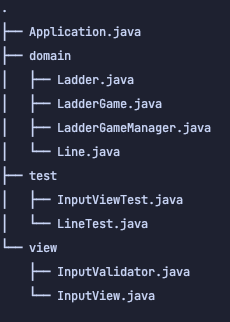
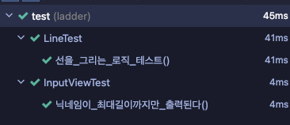
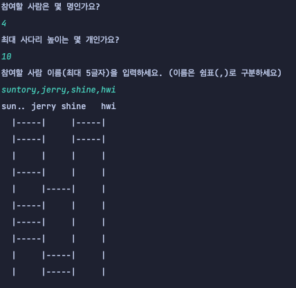
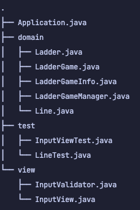
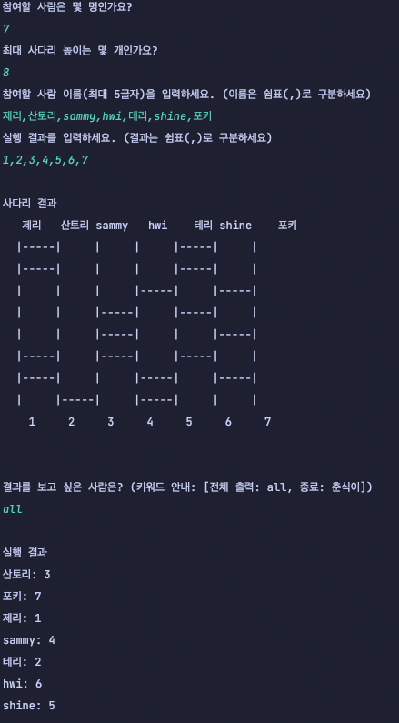

# java-ladder
2022 마스터즈 백엔드 사다리 게임 프로젝트

## Step 1: 기본 기능 구현

### 동작 방식
0. Application에서 `LadderGameManager.init()을 통해 실행합니다.
1. init() 내부의 inputNumber()를 통해 필요한 정보를 입력받습니다.
2. 입력받은 정보를 통해 Ladder 객체를 만들고 Ladder의 생성자에서 2차원 배열 형태의 사다리를 만듭니다.
3. LadderGameManager.showLadder()를 통해 사다리 정보를 출력합니다.

## Step 2: 리팩토링 맛보기

### 리팩토링 내용
0. 메서드의 크기가 너무 커지지않도록 함수 내부 로직을 분리하려고 하였습니다.
1. 들여쓰기 depth, else 사용 등을 피하기 위해 메서드를 분리하였습니다. 

## Step 3: 사다리 모양 개선

### 목표
- 사다리의 가로대가 겹치지 않도록 생성하는 로직을 추가한다.
- 사다리 게임의 유저 이름을 표시할 수 있도록 폭을 넓힌다.
- 유저 이름을 추가하는 로직을 추가한다.
  - `InputController`에 `,`로 구분하여 입력을 받는 함수를 추가한다.
  - `LadderGameManager`에서 그 함수를 호출하여 유저 닉네임 정보를 받는다.
  - `LadderGame`을 생성할 때 유저 정보를 넘겨준다.
  - `LadderGame`에서 닉네임 정보와 사다리 정보를 출력한다. 
    - 닉네임 정보 출력할 때 사다리랑 줄 맞추려면?
      - 첫 사다리는 +3칸 지점에서 시작한다.
      - 닉네임의 가운데가 그 지점에 오도록 여백을 주면 된다.
      - 그 다음 닉네임 간격을 6글자씩 띄도록 만들면 정확하다.
- 게임에 필요한 정보를 입력받을 때 검증을 담당하는 클래스를 추가한다. 
  - 닉네임 최대 길이, 유효한 숫자 등을 검증해야 한다.

### 동작 방식
0. Application에서 `LadderGameManager.init()`을 통해 실행합니다.
1. init() 내부의 InputController 호출을 통해 참여 인원, 사다리 높이, 닉네임을 입력받습니다.
2. 입력받은 값이 잘 입력되었는지 검증합니다. 
3. 입력받은 정보를 통해 Ladder 객체를 만들고 Ladder의 생성자에서 2차원 ArrayList 형태의 사다리 자료구조를 만듭니다.
4. 자료 구조를 만들 때 각 사다리 사이가 공백인지, 이어져있는지를 판단하여 올바른 사다리 모양을 만드는 로직을 거칩니다.
5. LadderGameManager.showLadder()를 통해 사다리 정보와 유저 정보를 출력합니다.

## Step 4: 리팩토링 2

### 목표
- 사다리의 가로줄을 `Line` 객체로 만들어 `ArrayList<ArrayList>`와 같은 코드를 리팩토링한다.
- `Line` 객체에서 선을 그릴 수 있는지 여부를 판단하는 로직에 대한 단위 테스트를 추가한다.
- 사다리 결과를 출력할 때 최대 5 글자를 정확히 출력하는지 처리하는 로직에 대한 테스트를 추가한다.
- 적절히 패키지를 분리한다.

### 동작 방식
0. Application에서 `LadderGameManager.init()`을 통해 실행합니다.
1. `init()` 내부의 `InputView`를 통해 참여 인원, 사다리 높이, 닉네임을 입력받습니다.
2. 입력받은 값이 잘 입력되었는지 검증합니다.
3. 특히, 닉네임은 5글자를 초과하면 3글자부터 자르고 `..`로 생략합니다.
4. 입력받은 정보를 통해 Ladder 인스턴스를 만들고 Ladder 클래스의 생성자에서 사다리의 각 행에 해당하는 Line 인스턴스를 생성합니다.
5. Line 인스턴스를 만들 때, 각 사다리 사이가 공백인지, 이어져있는지를 판단하여 올바른 사다리 모양을 만드는 로직을 거칩니다.
6. Ladder 클래스 내부에서 ArrayList<Line>의 형태로 보관합니다.
7. LadderGameManager.showLadder()를 통해 사다리 정보와 유저 정보를 출력합니다.

### 패키지 구조

### 테스트 결과

### 실행 결과

## Step 5: 실행결과 출력

### 목표
- 사다리 게임 실행 결과를 출력한다.
  - 사다리 게임 실행 결과를 입력받아야 한다.
  - 사다리 게임 진행 로직을 추가해야 한다.
- 개인별 이름을 입력하면 개인별 결과를 출력하고, "all"을 입력하면 전체 참여자의 실행 결과를 출력한다.
  - 사다리 게임 수행 이후 개인별로 결과를 저장해야 한다.
- 이름에 "춘식이"를 입력하면 프로그램을 종료한다.
  - "춘식이"를 입력할 때까지 메인 스레드가 종료되어서는 안된다.
- `Setter` 메소드 사용을 지양한다.

### 동작 방식
0. Application에서 `LadderGameManager.init()`을 통해 실행합니다.
1. `init()` 내부의 `InputView`를 통해 참여 인원, 사다리 높이, 닉네임, 실행결과를 입력받아 `LadderGameInfo` 인스턴스를 만듭니다.
2. 입력받은 값이 잘 입력되었는지 검증합니다. 특히, 닉네임은 5글자를 초과하면 3글자부터 자르고 `..`로 생략합니다.
3. `LadderGameInfo` 인스턴스를 담아 `Ladder` 인스턴스를 만들고 `Ladder` 클래스의 생성자에서 사다리의 각 행에 해당하는 `Line` 인스턴스를 생성합니다.
4. `Line` 인스턴스를 만들 때, 각 사다리 사이가 공백인지, 이어져있는지를 판단하여 올바른 사다리 모양을 만드는 로직을 거칩니다.
5. `Ladder` 클래스 내부에서 ArrayList<Line>의 형태로 보관합니다.
6. `LadderGameManager.showLadder()`를 통해 사다리 정보와 유저 정보를 출력합니다.
7. `LadderGameManager.showResult()`를 통해 결과를 확인할 닉네임을 입력받습니다.
8. `InputView`를 통해 입력받은 이름을 `LadderGame`의 `printResultMapByName`에 전달합니다.
9. 종료 키워드를 입력하면 게임이 종료됩니다.

### 패키지 구조

### 테스트 결과

### 실행 결과
